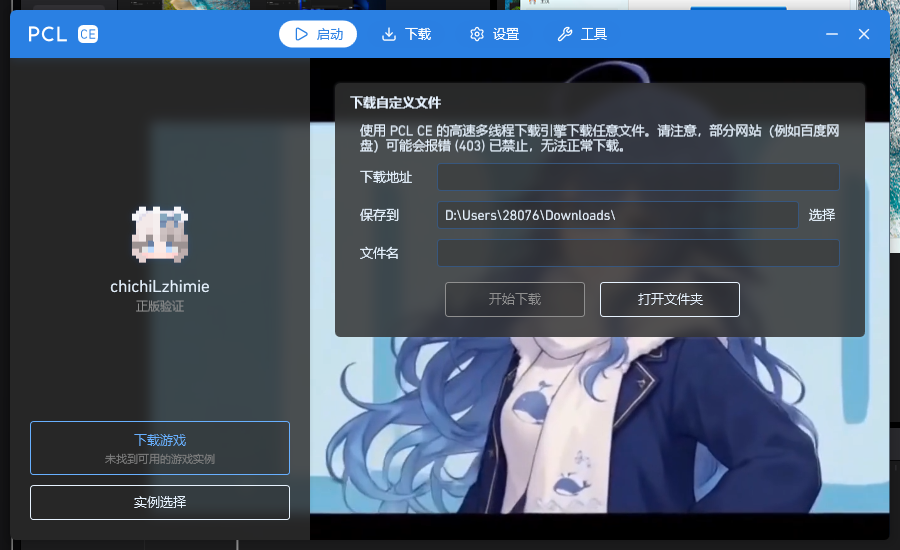
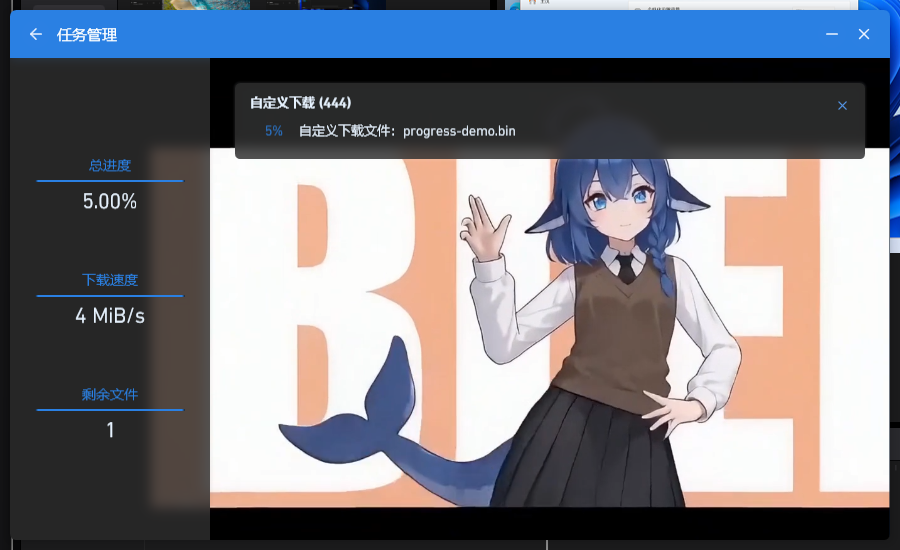
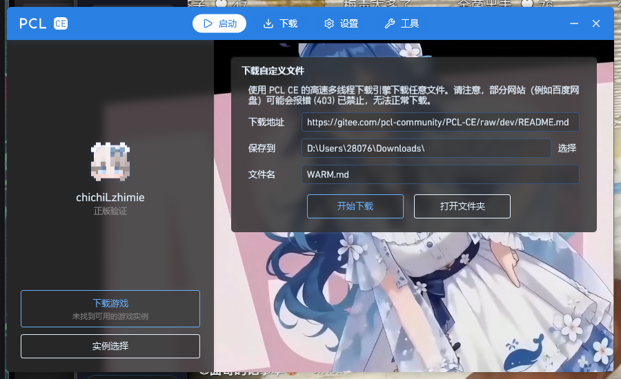
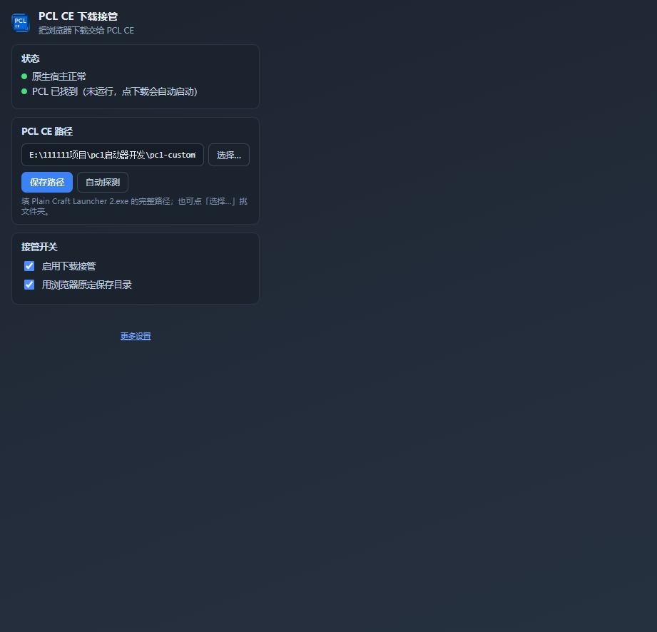

# PCL CE 浏览器下载接管

> 像 IDM / NDM 那样接管浏览器下载，把文件交给 [PCL CE](https://github.com/PCL-Community/PCL-CE) 的多线程下载引擎。

网页上点下载 → 自动唤起 PCL CE → **窗口出现时链接和文件名已经填好** → 停在主页等你点「开始下载」。

PCL CE 侧的改动完全遵守「**只填表、绝不自动下载**」：永远由你确认后才开始。

---

## 特性

| 特性 | 说明 |
|---|---|
| 🚀 冷启动即填好 | PCL 没开时用启动参数把链接带进去，窗口出现即为填好（实测 3.3 秒） |
| ⚡ 热启动毫秒级 | PCL 已开时经命名管道 RPC 填入，实测 0.07 秒 |
| 🪟 自动置顶 | 不管 PCL 在后台还是最小化，点下载都会恢复并跳到最前 |
| 🏠 主页就有卡片 | 右侧顶部直接可填，不必进「工具 → 百宝箱」 |
| 🔁 两处双向同步 | 主页与百宝箱的输入内容互相同步 |
| 📊 一键看进度 | 点「开始下载」自动跳「任务管理」页看进度与速度 |
| ✋ 绝不自动下载 | 只填表，开始与否始终由你决定 |
| 🖱️ 不碰鼠标 | 走 RPC 通信，不模拟点击、不抢焦点（旧版 UI 自动化仅作降级备份） |

## 演示

| 主页卡片 | 点开始后跳到进度页 |
|---|---|
|  |  |

| 冷启动即填好 | 工具栏弹窗 |
|---|---|
|  |  |

---

## 工作原理

```
网页点下载
   ↓ ① 扩展拦截（chrome.downloads.onDeterminingFilename）
   ↓    取消浏览器下载，拿到 URL 与文件名
   ↓ ② 原生消息（Native Messaging）交给本机宿主
   ↓ ③ 宿主判断 PCL 是否在运行：
   │
   ├─ 没在运行 → 用启动参数拉起 PCL
   │              PCL2.exe --download "<url>" --filename "<name>" [--folder "<dir>"]
   │              PCL 在主窗口创建之前解析参数 → 窗口出现即为填好的
   │
   └─ 已在运行 → 命名管道 RPC
                  REQ download
                  {"url":"...","filename":"..."}
                  ← 填入主页卡片 + 把窗口置顶
   ↓
停在填好的界面，等你点「开始下载」
```

### 三个关键机制

**1. 命名管道 RPC**

PCL CE v2.15.0 自带 RPC 服务，管道名 `PCLCE_RPC@<PID>`。本项目的补丁注册了一个 `download` 函数：

```csharp
[RegisterRpc("download")]
public static RpcResponse OnRpcDownload(string? argument, string? content, bool indent)
```

**2. 启动参数（冷启动的关键）**

PCL 在 `Application._ApplicationStartup()` 里解析命令行参数，这段代码运行在**主窗口创建之前**。
补丁在这里解析 `--download` 系列参数并写入共享状态，因此主页卡片一被创建就是填好的。

**3. 窗口置顶**

后台进程直接调 `SetForegroundWindow` 会被 Windows 拒绝（只会闪任务栏图标），
所以使用 `AttachThreadInput` 技巧：先把本线程输入队列挂到当前前台线程，再顶窗，最后解除挂接。

---

## 基于哪个版本改写 ★

本项目的 **PCL CE 侧改动**（`pcl-patch/`）基于以下确切版本：

| 项 | 值 |
|---|---|
| 上游仓库 | https://github.com/PCL-Community/PCL-CE |
| 版本标签 | **`v2.15.0`** |
| 提交 SHA | **`12bb0ea2517de810c4d6da3daf63239c8a9d9bdf`** |
| 源码包 | https://codeload.github.com/PCL-Community/PCL-CE/zip/refs/tags/v2.15.0 |
| 目标框架 | `net10.0-windows`（需 .NET 10 SDK 编译） |
| 协议 | Apache License 2.0 |

> ⚠️ **为什么必须写明版本**：`v2.15.0` 是 PCL CE 完成 C# 重写的版本，
> RPC 基础设施（`RpcService` / `RegisterRpc`）与「百宝箱」的 `StartCustomDownload` 都依赖它。
> **更早的版本（如 v2.14.x）没有可用的 RPC 服务**，本补丁无法工作。

### 改动清单（共 6 个文件：新增 2、修改 4、删除 0）

| # | 文件 | 类型 | 作用 |
|---|---|---|---|
| 1 | `PCL.Core/App/CustomDownloadState.cs` | 新增 | 主页/百宝箱/RPC/启动参数共享的输入内容 |
| 2 | `PCL.Core/App/Essentials/RpcDownloadExtension.cs` | 新增 | `download` RPC：切主页、填表、置顶 |
| 3 | `Plain Craft Launcher 2/Application.xaml.cs` | 修改 | 解析 `--download` 等启动参数（+36 行） |
| 4 | `Plain Craft Launcher 2/Pages/PageLaunch/PageLaunchRight.xaml` | 修改 | 主页右侧新增下载卡片（+84 行） |
| 5 | `Plain Craft Launcher 2/Pages/PageLaunch/PageLaunchRight.xaml.cs` | 修改 | 卡片逻辑、输入同步、置顶（+163 行） |
| 6 | `Plain Craft Launcher 2/Pages/PageTools/PageToolsTest.xaml.cs` | 修改 | 与主页双向同步（+44 行） |

合计：**+640 行 / -3 行**。详细差异见 [`pcl-patch/pcl-download-rpc.patch`](pcl-patch/pcl-download-rpc.patch)。

### 应用补丁

```bash
# 1. 取得对应版本源码
curl -L -o pcl-ce.zip https://codeload.github.com/PCL-Community/PCL-CE/zip/refs/tags/v2.15.0
unzip pcl-ce.zip && cd PCL-CE-2.15.0

# 2. 应用补丁
git apply /path/to/pcl-patch/pcl-download-rpc.patch

# 3. 编译（需 .NET 10 SDK；Release + x64）
dotnet build "Plain Craft Launcher 2/Plain Craft Launcher 2.csproj" -c Release -p:Platform=x64
```

也可以直接拷贝 [`pcl-patch/files/`](pcl-patch/files) 中已改好的 6 个文件覆盖到源码树。

---

## 安装

### 前置要求

| 项 | 要求 |
|---|---|
| 浏览器 | Microsoft Edge 或 Google Chrome（102+，需支持 Manifest V3） |
| 操作系统 | Windows 10 1809 及以上 |
| PCL CE | v2.15.0，**且带本补丁**（见下方「两种用法」） |
| .NET | 仅编译时需要 .NET 10 SDK；运行需 .NET 10 Desktop Runtime |

### 两种用法

| 方式 | 说明 | 能用到哪些特性 |
|---|---|---|
| **A. 自编译版 PCL**（推荐） | 打上本补丁后自行编译 | 全部特性（冷启动即填好、毫秒级、自动置顶、主页卡片） |
| **B. 官方版 PCL** | 直接使用官方发布版 | 仅基础接管，靠 UI 自动化，**慢得多**（约 11 秒）且会短暂抢占鼠标 |

### 第 1 步：加载浏览器扩展

1. 打开 `edge://extensions/`（Chrome 为 `chrome://extensions/`）
2. 打开左下角「**开发人员模式**」
3. 点「**加载解压缩的扩展**」，选择本仓库的 `extension/` 目录
4. 记下扩展卡片上显示的 **扩展 ID**（形如 `abcdefghijklmnopabcdefghijklmnop`），下一步要用

### 第 2 步：安装原生宿主

原生宿主是浏览器与 PCL 之间的桥梁，必须安装，否则扩展无法工作。

```powershell
# 在仓库根目录执行（无需管理员，只写当前用户注册表）
powershell -ExecutionPolicy Bypass -File native-host\install-native-host.ps1
```

脚本会自动完成：

- 识别扩展 ID（也可用 `-ExtensionId <32位ID>` 手动指定）
- 写入原生消息清单 `cc.pclc.download_bridge.json`（**必须是无 BOM 的 UTF-8**，脚本已处理）
- 在注册表注册到 Edge / Chrome 及其 Beta / Dev / Canary 通道

卸载：

```powershell
powershell -ExecutionPolicy Bypass -File native-host\install-native-host.ps1 -Uninstall
```

### 第 3 步：让 PCL 支持 RPC

有两种选择：

**① 自己编译**（见上方「应用补丁」），产物在：

```
Plain Craft Launcher 2/bin/Release/net10.0-windows/win-x64/
```

**② 使用现成产物**：把编译好的目录整体保留（属框架依赖发布，**不能只复制 exe**）。

首次使用需在扩展里指定 PCL 路径：点工具栏扩展图标 → 在「PCL CE 路径」里填入
`Plain Craft Launcher 2.exe` 的完整路径（**也可以只填它所在的文件夹**，会自动解析），点「保存路径」。

### 第 4 步：验证

1. 点扩展工具栏图标，确认两行状态都是**绿点**：
   - `原生宿主正常`
   - `PCL 已找到` 或 `PCL 正在运行`
2. 找一个可直接下载的直链（GitHub Release、网盘直链等），点击下载
3. 预期：PCL 被唤起并置顶，主页卡片里**已经填好**地址与文件名，等你点「开始下载」

---

## 目录结构

```
├── extension/              # 浏览器扩展（Manifest V3）
│   ├── manifest.json
│   ├── background.js       # 拦截下载 → 调用原生宿主
│   ├── popup.html/js       # 工具栏弹窗：状态 / PCL 路径 / 开关
│   ├── options.html/js     # 完整设置页
│   └── icons/
├── native-host/            # 原生消息宿主（Windows / PowerShell）
│   ├── native-host.cmd     # 必须是可执行文件，指向下面的 ps1
│   ├── native-host.ps1     # 主体：定位 PCL、启动、RPC、UI 自动化降级
│   ├── install-native-host.ps1   # 一键安装/卸载
│   └── test-native-host.ps1      # 命令行自测工具
├── pcl-patch/              # ★ PCL CE 侧改动
│   ├── README.md
│   ├── pcl-download-rpc.patch      # 针对 v2.15.0 的补丁
│   └── files/                      # 已改好的文件（可直接覆盖）
├── docs/                   # 截图
├── NOTICE                  # 修改声明（Apache-2.0 第 4(b) 条要求）
├── LICENSE                 # Apache License 2.0
└── CHANGELOG.md
```

---

## 配置

运行期配置与日志都在用户目录，不在本仓库内：

| 项 | 路径 |
|---|---|
| 宿主配置 | `%LOCALAPPDATA%\PCLDownloadBridge\config.json` |
| 宿主日志 | `%LOCALAPPDATA%\PCLDownloadBridge\bridge.log` |
| 扩展设置 | 扩展设置页（存在浏览器本地存储） |

扩展设置项：

| 项 | 默认 | 说明 |
|---|---|---|
| 启用下载接管 | 开 | 关闭后所有下载交回浏览器 |
| 静默接管 | 开 | 开=直接交给 PCL，不弹确认窗；关=每次弹窗确认 |
| 用浏览器原定保存目录 | 开 | 关则用 PCL 记住的目录 |
| PCL CE 路径 | 空（自动探测） | 可填 exe 或所在文件夹 |

> **保存目录的记忆**由 PCL 自己负责（`States.Tool.DownloadFolder`）。
> 本项目**不会**用默认目录覆盖你在 PCL 里改过的位置。

---

## 常见问题

<details>
<summary><b>状态灯是红的 / 报「找不到 PCL CE」</b></summary>

点扩展图标 → 「PCL CE 路径」填入正确路径 → 「保存路径」。
选文件夹也可以，会自动在里面找 `PCL.exe` / `Plain Craft Launcher 2.exe` / `PCL2.exe`。
</details>

<details>
<summary><b>报「Access to the specified native messaging host is forbidden」</b></summary>

扩展 ID 与宿主清单里的 `allowed_origins` 不匹配。重跑安装脚本即可（它会重新读取扩展 ID）。
若手动改过清单，注意两点：

1. 清单必须是 **无 BOM 的 UTF-8**，有 BOM 会直接失败
2. 清单里的 `path` 必须是**可执行文件**（所以指向 `.cmd` 而不是 `.ps1`）
</details>

<details>
<summary><b>PCL 弹出来了，但字段是空的</b></summary>

多半是用了**官方版 PCL**（没有 `download` RPC）。检查宿主日志：

```
%LOCALAPPDATA%\PCLDownloadBridge\bridge.log
```

看到 `RPC 不可用，回退 UI 自动化` 就说明是这个问题 —— 请使用带补丁的自编译版。
</details>

<details>
<summary><b>出现 <code>[Link] Failed to get announcement</code> 两条报错</b></summary>

这是 PCL「联机 → 大厅」拉取公告失败，与下载接管无关。

如果你用的是**自编译版**，原因是 PCL 的联机服务器地址来自构建时注入的密钥 `LINK_SERVER_ROOT`，
不带密钥构建时该值为空，`"".Split("|")` 得到 `[""]`，于是去请求相对路径 `/api/link/v2/cache.ini` 必然失败。
**自编译版的联机功能不可用**，需要联机请用官方版。
</details>

<details>
<summary><b>下载完成后不知道文件在哪</b></summary>

看 PCL 里「保存到」那一栏，或点卡片上的「打开文件夹」。
该位置由 PCL 记忆，你改过之后不会被覆盖。
</details>

---

## 已知限制

1. **仅 Windows** —— 宿主脚本依赖 Windows 注册表、PowerShell 与命名管道（PCL CE 本身也只支持 Windows）
2. **官方版 PCL 体验较差** —— 没有 RPC 时只能退回 UI 自动化，慢且会短暂抢占鼠标
3. **自编译版不自动更新** —— 官方发布新版后需重新套用补丁编译
4. **自编译版缺官方密钥** —— CurseForge 下载、MirrorChyan CDK、联机等功能可能不可用
5. **部分站点无法接管** —— PCL 自身对 403（如百度网盘）有说明，非本项目的限制

---

## 开发

```powershell
# 宿主自测（不经过浏览器，直接喂 native messaging 帧）
powershell -ExecutionPolicy Bypass -File native-host\test-native-host.ps1

# 语法检查（宿主脚本必须存为 UTF-8 with BOM，否则 PowerShell 5.1 会按 GBK 解析）
```

**开发注意**：

- `native-host.ps1` / `install-native-host.ps1` / `test-native-host.ps1` 必须保存为 **UTF-8 with BOM**
- `native-host.cmd` 必须保存为 **纯 ASCII 无 BOM**
- 原生消息清单必须保存为 **无 BOM 的 UTF-8**

---

## 协议与致谢

- 本项目采用 [Apache License 2.0](LICENSE) 授权
- 其中 PCL CE 侧的改动是 [PCL CE](https://github.com/PCL-Community/PCL-CE) 的衍生作品，
  同样采用 Apache License 2.0；来源、版本与修改内容见 [NOTICE](NOTICE)
- 感谢 [PCL Community](https://github.com/PCL-Community) 与 PCL CE 的各位贡献者
- 点名致谢 PCL CE 已有的 RPC 基础设施（`RpcService`），本项目的 `download` 函数正是基于它注册的

## 反馈

欢迎提 Issue 与 PR。如果这个项目对你有用，也欢迎把它推荐给 PCL CE 官方；
`pcl-patch/` 里的改动是独立、低侵入的，适合直接合入上游。
